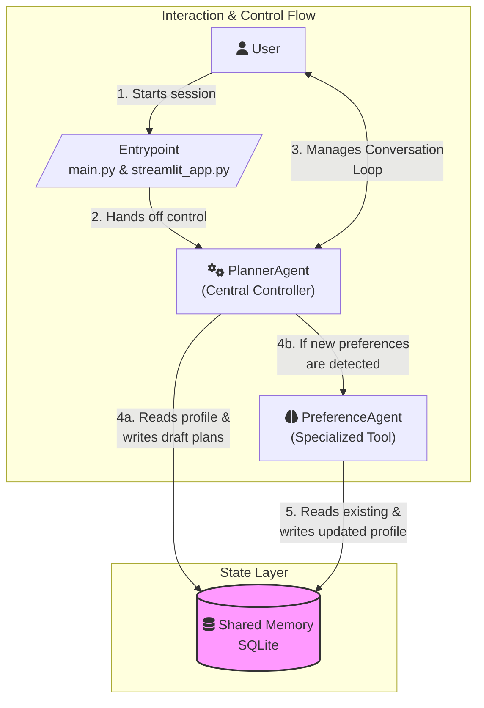

# 🍽️ Meal Planner — Multi-Agent System with Shared Memory

A two-agent meal-planning system that remembers evolving user preferences, generates rationalized meal plans, and resumes gracefully after interruptions — all built around a shared SQLite memory.

## 🏗 Architecture Overview

The Meal Planner follows a **"Planner-Led"** architecture that still adheres to the "One Memory" principle. Agents collaborate by reading from and writing to a shared SQLite database, ensuring they remain decoupled.



### The Core Components

1.  **Shared Memory (SQLite):** The single source of truth for the entire system managed by `core/memory_layer.py`. It stores user profiles, preferences, draft plans, and the system's execution state.
2.  **Entrypoint (`main.py`):** The system's launcher, responsible for handling initial session resume logic before handing off control to the PlannerAgent.
3.  **PlannerAgent:** It manages the main conversation loop with the user. It can either chat or generate a 3-day meal plan. Crucially, its underlying language model decides if the user's input contains new preferences that need to be saved. Its behavior is defined by a version-controlled prompt in the `prompts/` directory.
4.  **PreferenceAgent:** A specialized "tool" agent. It is called by the `PlannerAgent` only when new preferences are detected. It parses natural language into a structured profile and saves it directly to the shared memory.
5.  **Core Services:** A collection of shared modules under `core/` provides the foundation for the system:
    *   **`reasoning.py`**: Contains the logic for intelligently merging and updating user preferences.
    *   **`logging_layer.py`** & **`error_handler.py`**: Ensure the system is observable and resilient.
    *   **`config/settings.py`**: Centralizes all configuration, from model names to file paths.

## 📦 Memory Structure

The system's state is centralized in a single SQLite database (`dashboard.db`), which makes it transparent and durable.

*   **`profiles`**: Stores evolving user preferences. It separates long-term base preferences (allergies) from adaptive weightages (cuisine likes/dislikes score) and ephemeral session overlays (cravings that expire after 7 days).
*   **`recipes`**: A static dataset of available meals the planner can choose from.
*   **`plans`**: Stores generated meal plans with their status (draft, approved, rejected) and the rationale behind them.
*   **`run_state`** & **`errors`**: These tables track the session's progress and log any failures, enabling the system to recover from interruptions.

When the `PlannerAgent` detects a preference change, it invokes the `PreferenceAgent`. This agent reads the existing profile from memory, uses the reasoning module to merge the new information, and writes the complete, updated profile back to the database.

## ⚙️ Resilience: Pause, Resume & Error Handling

Because all state is persisted to SQLite after every meaningful action, the system is crash-proof.

### How Pause/Resume Works

The `main.py` script checks the `run_state` table at the start of every session. If it finds a `paused` or `failed` status, it prompts the user to resume, reconstructing the session from the database and logs.

### Error Handling

If an agent encounters an error (e.g., an API failure), `core/error_handler.py` catches it and writes a structured entry to the `errors` table. Simultaneously, `core/logging_layer.py` writes detailed, human-readable session traces to files in the `logs/` directory, which is useful for debugging complex interactions.

## 🚀 Running the System

Excellent points. Here are the specific additions for your README.md file.

***

### Prerequisites

*   Python 3.10+
*   An environment file named `.env` in the project's root directory. Copy the following template and replace `YOUR KEY HERE` with your Google Gemini API key.

```ini
# --------------------------------------------------
# ENVIRONMENT CONFIGURATION
# --------------------------------------------------

# 🔐 Gemini API key (Required)
GEMINI_API_KEY="YOUR KEY HERE"

# 🗃️ SQLite DB location (Optional: defaults to posha.db if not set)
DATABASE_PATH=posha.db

# 🌡️ Environment mode (For future use, e.g., 'production')
ENV=development

# 🪵 Toggle detailed prompt/response logging for debugging (true/false)
LOG_PROMPTS=true

# 🪵 Set the console logging level (INFO, DEBUG, WARNING)
LOG_LEVEL=INFO
```

### Installation
```bash
# Create virtual environment
python3 -m venv venv
source venv/bin/activate  # or venv\Scripts\activate on Windows

# Install dependencies
pip install -r requirements.txt

# Initialize database (happens automatically on first run, 
# but can be forced by running the memory layer directly)
python3 -m core.memory_layer
```

### Using the CLI
The CLI is the fastest way to interact with Posha.
```bash
# Start a session for a specific user
python3 main.py --user-id=user_001

# You can also pass an initial prompt directly
python3 main.py --user-id=user_001 --text="I want quick weekday dinners, no mushrooms, high protien"
```

### Using the Web UI (Streamlit)
For a richer experience with visual plan rendering:
```bash
streamlit run streamlit_app.py
```

### Direct Agent Testing (via CLI)

In addition to running the full workflow with `main.py`, you can test each agent in isolation directly from the command line. 

#### PreferenceAgent
To test how the `PreferenceAgent` interprets a piece of natural language and updates a user's profile:

```bash
# The --user-id and --text arguments are required
python3 -m agents.preference_agent --user-id="test_user_01" --text="I want to start eating vegetarian, and I love spicy food."
```

#### PlannerAgent
To test the `PlannerAgent`'s ability to generate a plan based on existing preferences or a one-off instruction:

```bash
# --user-id is required, --text is optional
python3 -m agents.planner_agent --user-id="test_user_01" --text="Generate a quick 3-day plan for me."
```

***

### 🎬 Example Walkthrough: A Full User Session

Follow these steps in your terminal to experience the complete workflow, from setting preferences to resuming a paused session.

#### 1. Adding Preferences & Generating a Plan

First, let's start a session for a new user and give them an initial preference.

```bash
# We'll use the user ID 'demo_user' for this walkthrough
python3 main.py --user-id="demo_user"
```

The application will start and ask for your input.

```text
Enter a new preference (or press Enter to skip):
```

Type in a preference and press Enter.

> **`I am vegetarian and I want meals that are quick to prepare.`**

The system will first process this with the **PreferenceAgent**, confirming the update. Then, the **PlannerAgent** will immediately generate a plan that respects these new rules.

**Expected Output:**
```text
🧠 Updating preferences...
✅ Preferences updated.

📋 Generating meal plan...
✅ Draft meal plan created.

  📅 Day 1:
    • Quick Tofu Stir-fry
    • Lentil Soup
  📅 Day 2:
    • Black Bean Burgers
    • 15-Minute Veggie Pasta
  ...

💡 Rationale: This plan is fully vegetarian and focuses on recipes with low preparation times as requested.

Let us know if you like the plan (Enter A), want to request changes (type feedback), press R to reject, or Enter E to exit:
```

---

#### 2. Approving or Rejecting the Plan

Now that a plan is waiting for feedback, you can test the human-in-the-loop step.

*   **To Approve:** Type `a` and press Enter.
    *   **Expected Output:** `🎉 Plan approved and finalized (plan_id=...).` The session ends successfully.

*   **To Reject & Refine:** Type how you want to refine directly or type `r` and press Enter. The system will ask for a reason.
    *   **Input:** `The recipes seem a bit boring.`
    *   **Expected Output:** The system will save your feedback and the `PlannerAgent` will loop, using this new context to generate a *different* plan that tries to be more interesting.

---

#### 3. Resuming a Paused Session

This demonstrates the system's resilience.

**Step 1: Start a session and get to the approval prompt.**
```bash
# Use a different user ID to ensure a clean state
python3 main.py --user-id="resume_user_01"
```
Provide any preference (e.g., "no spicy food") and wait for the plan to be generated.

**Step 2: Simulate a crash.**
When the system is waiting for your approval, press `Ctrl+C` on your keyboard.

**Expected Output:**
```text
⚠️ Interrupted by user. Saving session state...
💾 Session paused. You can resume later.
```

**Step 3: Relaunch the application for the same user.**
Run the exact same command again.
```bash
python3 main.py --user-id="resume_user_01"
```

**Expected Output:**
The system will detect the unfinished run and prompt you to continue.
```text
⚠️ Previous session detected.
   Stage: planning | Status: paused
Do you want to resume it? (y/n):
```

Enter `y`. The system will restore the session exactly where you left off, presenting the same meal plan and once again asking for your approval. You have successfully resumed without any data loss.

***

## ⚠️ Limitations & Areas for Improvement

While this project is a robust prototype, several areas could be enhanced in a production environment:

*   **Database Scalability:** SQLite is excellent for this project's scope but would not support high concurrency. A production system would migrate to a database like PostgreSQL.
*   **Advanced Recipe Retrieval:** The Planner currently filters from a small recipe list. For a larger dataset, a semantic search system using vector embeddings would provide more relevant recipe candidates to the LLM.
*   **Stateful Conversation Memory:** The entire chat history is passed to the model on each turn. For longer conversations, this is inefficient. A summarization layer or a more sophisticated state-tracking mechanism would be necessary.
*   **Testing:** The project lacks a formal testing suite. Adding unit tests for the `core` modules and integration tests for the agent workflows would be a critical next step.